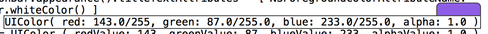

# ColorSenseRainbow
A plugin for Xcode that shows colours and allows you to modify them.  It works for both UIColor and NSColor in Swift and Objective-C.

When you place the caret over some code that declares a colour in Xcode then the code will be framed and a small rectangle will appear right above the text aligned to the right displaying that colour.  This allows you to view the colour.  I don't know about you but, except for some easy cases, I can't tell what a colour is by looking at the numbers.  For example the following leaves me baffled:

	UIColor( red: 143.0/255, green: 87.0/255.0, blue: 233.0/255.0, alpha: 1.0 )

But with the plugin it becomes:

If you click on the color then a color picker is displayed.  As you choose colours the code is updated.  One thing to note is if you select a predefined colour and start changing the colour then the code gets changed to RGB values.  In the other cases I've tried to keep it as non-destructive as possible though at times the number of decimal places can change.  When the alpha isn't specified (it isn't required as part of the Rainbow library as I set it to a default value of 1.0) then the plugin doesn't add the alpha component to the code.  You'll have to do that manually.

This project was inspired from [Color Sense for Xcode](https://github.com/omz/ColorSense-for-Xcode).  In fact it looks (and I think it behaves mostly) like it.  But I built it completely from scratch in Swift though I did use that project as a template for some items as I haven't done anything on the Mac side before.  

# Installing
There will three ways to install the plugin.

1. Download the code and build it.  Xcode will install the plugin in the right directory.  Restart Xcode.
2. Download the plugin and place it in the ~/Library/Application Support/Developer/Shared/Xcode/Plug-ins directory.  Restart Xcode.
3. (To come) Use the plugin Alcatraz to install.

# Why rewrite?  

I was having problems extending it to use my [Rainbow](https://github.com/NorthernRealities/Rainbow) and [Rainbow Creator](https://github.com/NorthernRealities/Rainbow-Creator) libraries.  I just figured that by the time that I learned how the plugin worked to extend it I had learned enough to rebuild it.  There were a few design decisions that I didn't agree with.  Not saying that they were wrong, they are just different than what I chose in my version.  

I'm very thankful to Ole Zorn for the original version and all those who worked on it after.  I couldn't have written my version with theirs.  I didn't know about plugins, color wells, or a number of other things that I learned while writing this.  

# Extending 
I've tried to make the code very modular and extensible.  I'll walk through two examples on how to expand the functionality.  Colours are found using a series of regular expressions.  Each one was kept as simple as possible to do a specific task.  I created a number of simple searches instead of having a few overly complex ones.  For example I could have had one regular expression that handled specifying float values (0.0-1.0), calculated values (45/255), and integer values (45) with the alpha being optional. Instead I made it into six regular expressions stored in three Seeker subclasses.  I felt that this decision greatly reduced the work when it came time to replace the code for new colors (the Builder classes) and improves readability.

When adding a new method of colour creation to be illustrated you should see if it is similar to something that the plugin already does.  Similarity would be creating a colour with the same parameters.

At the moment the Rainbow Creator library only works in Swift.  In there is a extension to UIColor and NSColor that allows you to create colours without having to divide integer values by 255.0.  If I were to implement the library in Objective-C then I would also need to update this plugin.  Because the Objective-C code using the library would be so similar to the Swift code the best place for me to update this plugin would be RainbowIntSeeker class.  All that needs to be done in this case is to create the new regular expressions and test.  

The classes that replace the code with the new color information parse the string and change the values instead of creating brand new code from scratch.  This has the benefit of keeping any formatting the user has put in (I like extra space) and it saves from having to write a bunch of if statements to check if the language is Swift or Objective-C and if the colour is a NSColor or an UIColor.  The disadvantage is that there are some functions that still use NSRange and may cause problems when used with text containing extended characters such as emoticons.

Assuming that you want to extend the plugin and it isn't for something simple like the above then you are going to need to a bit more work.  But hopefully not too much.  The following are the steps I would take to add the handling of the creation of colours using hue, saturation, and brightness (HSB).  When overriding a function metioned below take a look at the other classes as a template.  They all follow a similar pattern.

* Add a value to the CSRColorCreationType
* Create a new Seeker subclass
* Override the init method to define the regular expressions needed
* Override the processMatch method to store values when a match is made and create the color. (While you would create the color with HSB values you would want to get a copy of the color in the RGB colorspace as later on the plugin assumes the color is in that colorspace.  It **will crash** if you don't do this!)
* Add the new Seeker subclass object to the array found in ColorFinder.  It's probably best to do this at the end for performance reasons.  The most common ways to define colours should be at the front so they are found first reducing the amount of searching to be done.
* Create a new subclass of ColorBuilder
* Override the function stringForColor
* Add the new ColorBuilder subclass in the switch statement in the ColorBuilderFactory.